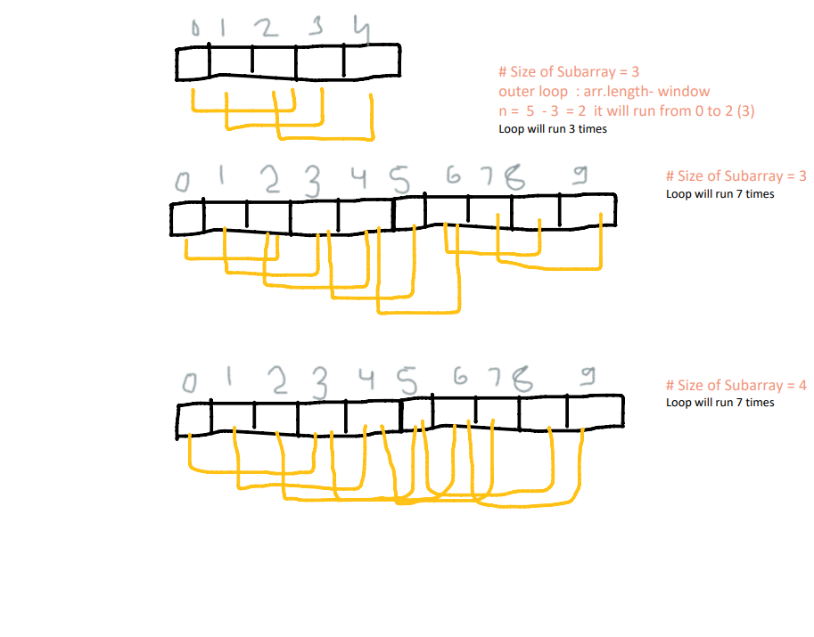
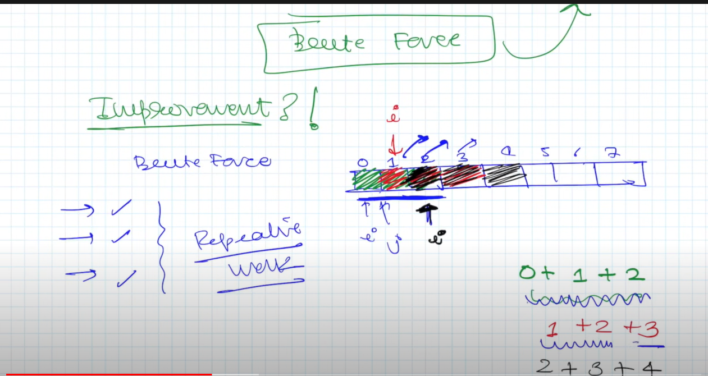

## Sliding Window Technique

Subarrays are the continuous elements in an array. 

**Sliding Window Technique** is a computational technique which aims to reduce the use of nested loop and replace it with a single loop, thereby reducing the time complexity.

### _Prerequisite to use Sliding window technique_
The use of Sliding Window technique can be done in a very specific scenario, where the size of window for computation is fixed throughout the complete nested loop. Only then the time complexity can be reduced. 

Example: 
Find the largest sum of k consecutive elements

Brute Force approach: 
It involves creating a nested loop which travels all the elements and its k consecutive neighbours find it's sum and comapres, and at last maximum is returned

```js
function maxSum(arr, windowSize){
    let maxTill = 0
    for(let i = 0; i<= arr.length - windowSize; i++ ){ 
    //subtracting arr.length -windowSize gives the element from the last - size of window 
    //ex: length of array is 7 and window is 3 then 7-3 = 4 so it will run till 4 {0,1,2,3,4} and not on 5 as 5+3 =8 undefined will be added
        let sum = 0;
        for(let j = i; j< i + windowSize; j++){ 
            sum += arr[j];
        }
        maxTill = Math.max(maxTill, sum)
    }
    return maxTill
}
```


```
So in order to optimize this Brute force approach everytime we see for: 
Repetative work : Whenever we see there is repeated work being done we can put some optimization there. 
```
The main idea behind the sliding window technique is to convert _two nested loops into a single loop_. Usually, the technique helps us to reduce the time complexity from ``O(n^2)`` to ``O(n)``.

Identification of sliding window Problem
- Question in most of the cases will be of array or string. 
- will always have subarray or substring involved
- will ask for smallest, largest etc. 
- k = window size will be given sometimes or sometimes to find it 
    ex: Find the continuous elemnts which make up sum S.

Sliding Window has two types
1. fixed size window - size of the window is fixed  
2. variable size window - we need to find the size . _example_: largest subarray of this sum   
    **largest or smallest window subjected to a condition**
Example: Maximum sum Sub array Problem
```js
function maxSumSubarray(arr, windowSize){
  let windowSum = 0;
  let maxSum = 0;
  for(let i = 0 ; i< windowSize; i++){
    windowSum += arr[i]
  }
  for(let end = windowSize-1; end < arr.length ; end++){
    windowSum += arr[end] - arr[end- windowSize]
    maxSum = Math.max(windowSum, maxSum)
  }
  return maxSum;
}

console.log(maxSumSubarray([2,5,1,898,2,9,1,88,8], 3)); 

/* 
Here we go from 0 to windowSize - 1 (2) [0,1,2] in the first loop and generating the sum basic motive is to create a window 
then in the second loop we just move forward with this window and getting the maximum sum and assigning it to the varibale. 
*/
```

So the basic idea is that we create a window with two pointers and when the difference reaches the window size we do the calculation and slide the window. 